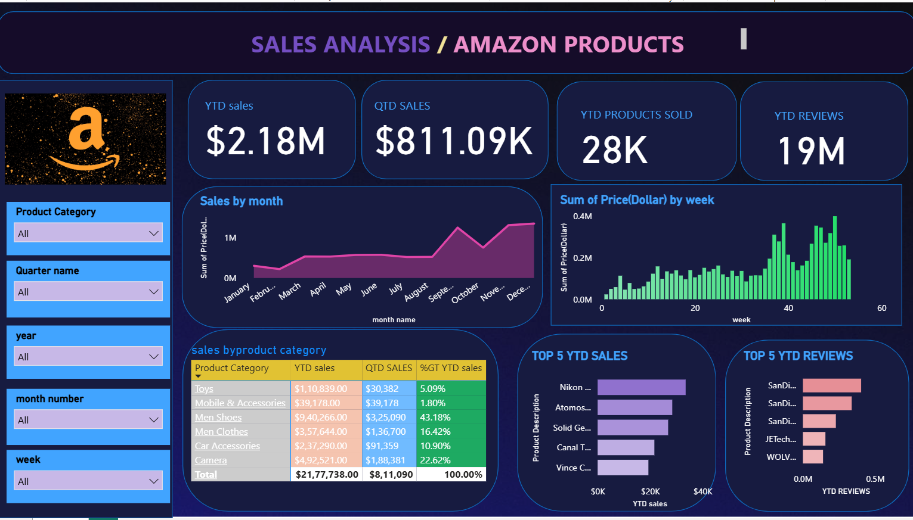

# 📊 Amazon Sales Analysis Dashboard

## Overview

The Amazon Sales Analysis Dashboard is an interactive Business Intelligence project developed using Power BI to analyze and visualize Amazon sales data. The dashboard transforms raw sales data into meaningful insights, helping users understand sales performance, product trends, customer engagement, and business growth.

## Objectives

* Analyze overall sales performance.
* Monitor key business KPIs.
* Identify top-performing products and categories.
* Track customer review trends.
* Support data-driven business decisions.

## Features

* Year-to-Date (YTD) Sales Analysis
* Quarter-to-Date (QTD) Sales Analysis
* Monthly Sales Trend Analysis
* Weekly Sales Performance Tracking
* Product Category Performance Insights
* Top 5 Products by Sales
* Top 5 Products by Reviews
* Interactive Filters and Slicers
* Dynamic KPI Monitoring

## Tools & Technologies

* Power BI
* Power Query
* DAX (Data Analysis Expressions)
* Microsoft Excel

## Dashboard Metrics

* YTD Sales: $2.18M
* QTD Sales: $811.09K
* Products Sold: 28K
* Customer Reviews: 19M

## Key Insights

The dashboard provides valuable insights into sales performance across different product categories and time periods. Users can easily identify sales patterns, high-performing products, and customer preferences through interactive visualizations and analytical reports.

## Skills Demonstrated

* Data Cleaning and Transformation
* Data Modeling
* Data Visualization
* Business Intelligence Reporting
* KPI Analysis
* Dashboard Design
* Analytical Thinking
* Data Storytelling

## Project Outcome

This project demonstrates how Business Intelligence tools can be used to convert large volumes of sales data into actionable insights. The dashboard helps businesses monitor performance, understand market trends, and make informed decisions through data-driven analysis.

## Dashboard Preview

Add the dashboard screenshot below:

